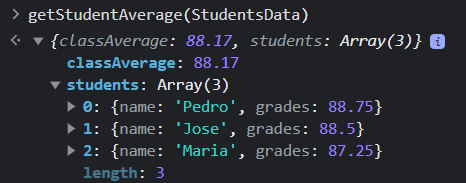

getStudentAverage es una función que recibe un array con la información de estudiantes, su nombre y sus notas; suma las notas de cada estudiando generando un promedio por cada uno de ellos, luego genera un promedio total de notas de todos los estudiantes, para así devolver un objeto que contiene la información del promedio general y el promedio de notas por cada estudiante, los resultados son dados en valor numérico y con dos decimales. 📝

